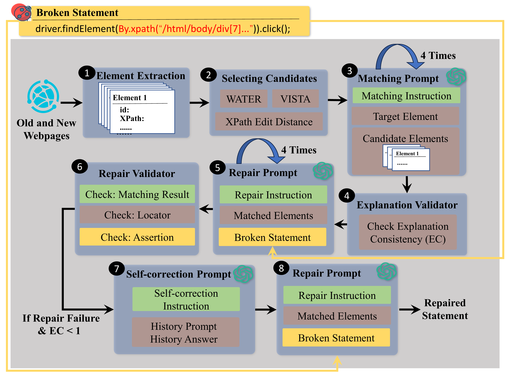

# ChatGPTUITestRepair

## Introduction

We present the first study that investigates the feasibility of using prior Web UI repair techniques for initial local matching and then using ChatGPT to perform global matching. Our key insight is thatGiven a list of elements matched by prior techniques, ChatGPT can leverage the language understanding to perform global view matching and use its code generation model for fixing the broken statements. To mitigate hallucination in ChatGPT, we design an explanation validator that checks whether the provided explanation for the matching results is consistent, and provides hints to ChatGPT via a self-correction prompt to further improve its results.

## Workflow

##### Element Extraction

Element extraction and candidate selection are finished with adapted UITestFix in folder ''Extraction''.

Run old web UI test scripts with UITestFix on old webpage can store the information of each element mentioned in each statement.

Run old tests on the new webpage. UITestFix will catch  exception when breakage happens. It will also extract elements from new webpage. 

##### Selecting Candidate 

From all the element extracted on the new webpage, we can generate candidate list with desired size and candidate selection algorithms and store them locally.

UITestFix can load the target element information stored in previous step so that we know the target element that we want to match when generating candidate list.

Then we can generate candidate list with desired size and candidate selection algorithms. In our experiment, we use three candidate selection approaches: VISTA, WATER and XPath Edit Distance. 

##### Matching prompts

Use ''chatgpt_repair.py'' to send designed matching prompt to ChatGPT and store the answer correspondingly.

##### Explanation Validator

Firstly, run ''generate_attributes.py'' to format the information of target element and candidate elements and store locally. 

Secondly, run ''generate_similarities.py'' to find out considering each attribute, which candidate element is the most similar one to the target element.

The file ''explanation_validator.py'' parse the matching result from ChatGPT's answer of matching prompt and the corresponding explanation. We ask ChatGPT to explain by listing the attribute it consider while matching. The validator check what attributes ChatGPT mentioned, whether the attribute is the most similar to that of target element on the old webpage.

##### Repair prompt

Use ''chatgpt_repair.py'' to send designed repair prompt to ChatGPT and store the answer correspondingly.

##### Repair Validator

"analysis_repair.py" parses the statement to separate assertion and locator parts and format them.

''analysis_repair1.py'' first checks whether the matching result is correct. If correct, then check whether the parts outside locator keep still. Thirdly, check whether ChatGPT repairs the locator according to given element information correctly.

##### Self-correction

We filter the repair failure cases whose explanation consistency is lower than 1 to generate self-correction prompt and let ChatGPT to self-correct. If ChatGPT selects a different matching result under the guidance,  we will send repair prompt according to its new selection to it. 

After finishing self-correction, we validate the result again to check whether there is any improvement.

## Dataset

##### Dataset folder contains:

broken statements

corresponding labelled ground-truth

candidate elements generated by 3 different approaches

target elements

prompts (matching prompt, repair prompt and self-correctness prompt)

corresponding answers